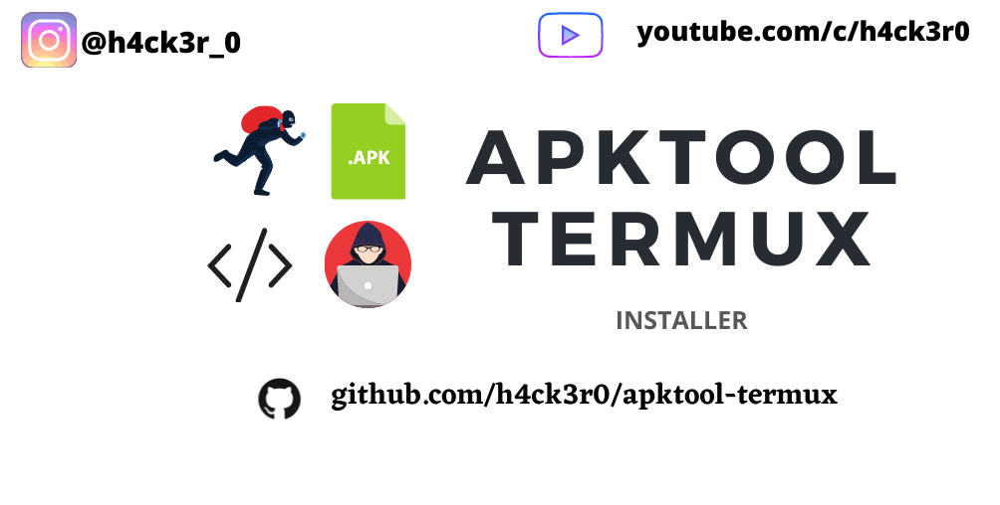

<p align="center">
<a href="https://h4ck3r0.github.io/"></a>
</p>
<p align="center">
<a href="https://h4ck3r0.github.io/"></a>
<a href="https://h4ck3r0.github.io/"></a>
<a href="https://h4ck3r0.github.io/"></a>
</p>
<p align="center">
 <a href=""></a>
</p>
<p align="center">
<a href="https://github.com/h4ck3r0"></a>
<a href="https://youtu.be/VDeLnDxVziw"></a>
</p>


### Aapktool-termux

Latest apktool 2.5.0 for Termux by H4Ck34

Version : 2.5.0 


### AVAILABLE ON :

* Termux

### REQUIREMENTS :

* Java


### FEATURES :
* [+] Latest Apktool !
* [+] Java  !
* [+] Error Fix !
* [+] Fully Automatic !
* [+] Easy for Beginners !

## INSTALLATION [Termux] :

* `apt-get update -y`
* `apt-get upgrade -y`
* `git clone https://github.com/h4ck3r0/Apktool-termux`
* `cd $HOME`
* `ls`
* `cd Apktool-termux`
* `chmod +x *`
* `bash setup.sh`
* `bash apktool.sh`
```
[+]-- Open new session in termux and Type apktool
```


# Credit

 Script by H4Ck34 (Raj Aryan)
 
 apktool 
 
 Java (hax4us)
 
# Error Solve
```
•If u using android 8+

•U get java error

•So type proot -0

•Then run apktool

```
## CONNECT WITH US :

<a href="https://github.com/h4ck3r0"></a>
[](https://rebrand.ly/loginx202266fb40)
[](https://rebrand.ly/h4ck3r-5064aa)
[](https://rebrand.ly/termuxcoding3d8527)
<a href="https://rebrand.ly/7elzgww"></a>

